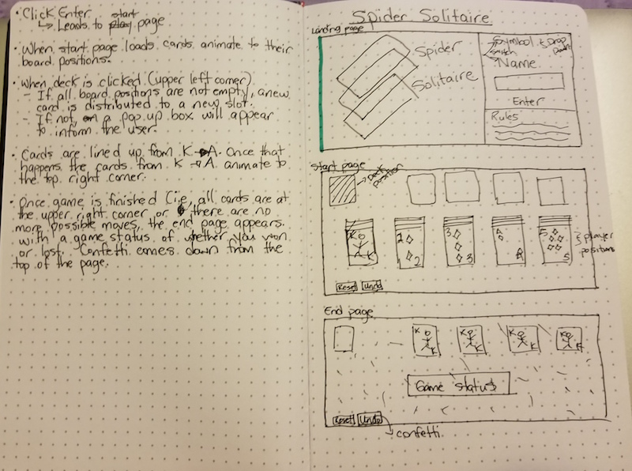
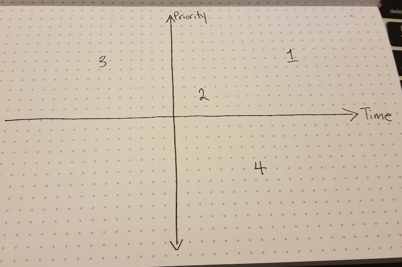

# Project Overview

## Project Schedule

This schedule will be used to keep track of your progress throughout the week and align with our expectations.  

|  Day | Deliverable | 
|---|---| 
|Day 1: Tue| Wireframes and Priority Matrix|
|Day 2: Wed| Project Approval /  Pseudocode / actual code|
|Day 3: Thur| Basic Clickable Model |
|Day 4: Fri| Working Prototype |
|Day 5: Sat| Final Working Project |
|Day 6: Sun| Bugs / Stylying / PostMVP |
|Day 7: Mon| Project Presentations |


## Project Description

<!-- Use this section to describe your final project and perhaps any links to relevant sites that help convey the concept and/or functionality. -->

The purpose of this game is to make 4 sets of thirteen cards each, with the cards in a sequence from King to Ace. There is only one suit being used for this game, and users are allowed to pick a suit they want the cards to feature. The users score is based on how long they took to create all sets.
- Site Example 1: http://www.free-spider-solitaire.com/
- Site Example 2: https://www.solitr.com/spider-solitaire-two-suits

## Wireframes

<!-- Include images of your wireframes.  -->


## Priority Matrix

Include a full list of features that have been prioritized based on the `Time and Importance` Matix. 

| Component | Priority | Estimated Time |
| --- | :---: |  :---: |
| Game Logic | 1 | 7hrs| 
| Card Animation | 2 | 4hrs| 
| Suits Creation | 3 | 3hrs| 
| Page Layout | 4 | 6hrs| 
| Total |  | 20hrs| 



## Game Components

### Landing Page
<!-- What will a player see when they start your game? -->
A player will see a welcome page that asks for a name and a suit (diamonds, hearts, etc.) of the cards they prefer when they start a game. The rules of the game will also be displayed.

### Game Initialization
<!-- What will a player see when the game is started?  -->
When the game is started cards will be shuffled and distributed from the deck position to the playing positions on the board. There will be a reset button and undo button on the page.

### Playing The Game
<!-- What will be the flow of the game, what will the user be expected to do and what will the user expect from the game. -->
Users will be able to click a card from the playing field on top of another card on the playing field, as long as the card being clicked on is one rank lower than the card it's being placed on. The goal is to try to get a sequence of 13 cards that are placed from King to Ace in less than 8 minutes. Once a sequence of 13 cards in the right order is met, that sequence is moved to one of the empty slots at the top right corner of the page. All four slots should be filled to win the game. Clicking on the deck of cards in the top left corner of the screen gives users more cards if needed. When you click the Undo button, the last move from the user will be cleared. The user will be able to click the Undo button as many times as possible, even to the start of the game, however their score will go down. The score of the user will be based on the time it took them to complete the game.

### Winning The Game
<!-- What does it look like when the game ends, what determines winning or losing? -->
Once the playing field is cleared of all cards and the deck is empty before 8 minutes, the user wins the game. If time runs out, then the user loses the game. Game status will be displayed in a pop up box. If user has won, confetti will appear on the screen.

### Game Reset
<!-- How will the user restart the game once it has been completed. -->
The user will be able to restart the game at any time. A reset button will be located on the board.

## MVP 

<!-- Include the full list of features that will be part of your MVP  -->
- 1 player game
- User will be greeted by name.
- Cards will be animated to move across the screen.
- Cards can be clicked to another card, if the rank of the card being clicked on is one rank lower than the card it's being placed on.
- Score will be determined by time.
- Creating the design of each card based on the suit the user has chosen.

## POST MVP

<!-- Include the full list of features that you are considering for POST MVP -->
- Have the computer give the user a hint as to what they could play for their next move
- Two suit game
- Four suit game

## Functional Components

Based on the initial logic defined in the previous game phases section try and breakdown the logic further into functional components, and by that we mean functions.  Does your logic indicate that code could be encapsulated for the purpose of reusablility.  Once a function has been defined it can then be incorporated into a class as a method. 

Time frames are also key in the development cycle.  You have limited time to code all phases of the game.  Your estimates can then be used to evalute game possibilities based on time needed and the actual time you have before game must be submitted. 

| Component | Priority | Estimated Time | Time Invested | Actual Time |
| --- | :---: |  :---: | :---: | :---: |
| Game Logic | 1 | 7hrs| 12hrs | 12hrs |
| Card Animation | 2 | 4hrs| 2hrs | 2hrs |
| Suits Creation | 3 | 3hrs| 3hrs | 3hrs |
| Page Layout | 4 | 6hrs| 7hrs | 8hrs |
| Game Score | 5 | 1hrs| 1hrs | 2hrs |
| Post-MVP | 6 | 10hrs| 1hrs | 1hrs |
| Total |  | 31hrs| 26hrs | 29hrs |


## Helper Functions
Helper functions should be generic enought that they can be reused in other applications. Use this section to document all helper functions that fall into this category.

| Function | Description | 
| --- | :---: |
| randomNumber(num) | This will generate a random number from 0 to num | 

## Additional Libraries
 Use this section to list all supporting libraries and thier role in the project. 

## Code Snippet

Use this section to include a brief code snippet of functionality that you are proud of and a brief description. 

```
  let moveHistory = [];

  class Moves {
    constructor(element, lastPlace, hideLC, hide) {
      this.element = element;
      this.lastPlace = lastPlace;
      this.hideLastCard = hideLC;
      this.hide = hide;
    }
    addToArray() {
      moveHistory.push(this);
    }
  }

  function addToMoveArray(arr1, arr2, hlc, hde) {
    const moves = new Moves(arr1, arr2, hlc, hde);
    moves.addToArray();
  }
``` 
A move object is created and then pushed into the moveHistory array. This keeps track of all moves made in the game, so you can undo one move at a time.

## jQuery Discoveries
 Use this section to list some, but not all, of the jQuery methods and\or functionality discovered while working on this project.

 ..* hasClass()
 ..* contents()

## Change Log
 Use this section to document what changes were made and the reasoning behind those changes.  

## Issues and Resolutions
 Use this section to list of all major issues encountered and their resolution.

 One issue I had was how long it took to test if my functions worked, i.e, checking for a full set from K to A.

#### SAMPLE.....
**ERROR**: app.js:34 Uncaught SyntaxError: Unexpected identifier                                
**RESOLUTION**: Missing comma after first object in sources {} object
